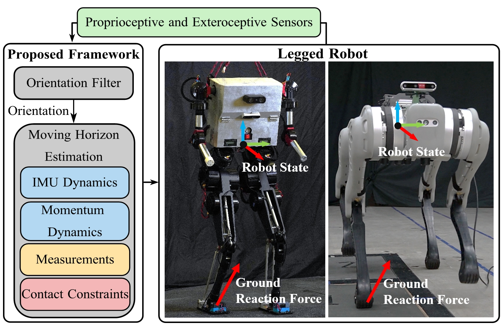

# Force-State-Estimation
## Simultaneous Ground Reaction Force and State Estimation via Constrained Moving Horizon Estimation

Accurate ground reaction force (GRF) estimation enhances the adaptability of legged robots in real-world environments. This paper presents a simultaneous GRF and state estimation framework that systematically addresses sensor noise and state-dynamics coupling. A decentralized Moving Horizon Estimation (MHE) approach is proposed, fusing proprioceptive and exteroceptive sensors with deterministic contact constraints in a convex optimization. The method achieves real-time (200 Hz) performance on various legged platforms, including the humanoid robot Bucky, and the quadruped Unitree Go1 & B1.

For more details, please refer to the paper. [[arxiv](https://arxiv.org/pdf/2411.12047)] [[youtube](https://www.youtube.com/watch?v=Bih7cslSkTo&t=2s)]



## Prerequisites

#### Ubuntu 20.04

#### [ROS2](https://docs.ros.org/en/galactic/index.html) (tested with foxy/galactic)

#### Eigen3

#### [OSQP](https://osqp.org/docs/get_started/)

#### [OpenCV 4.2.0](https://opencv.org/) 

#### [ORB_SLAM3](https://github.com/UZ-SLAMLab/ORB_SLAM3)

Go to this [[repo](https://github.com/zang09/ORB-SLAM3-STEREO-FIXED)] and follow build instruction. 

#### [ORB_SLAM3_ROS2](https://github.com/zang09/ORB_SLAM3_ROS2?tab=readme-ov-file)

Change this [line](https://github.com/well-robotics/Decentralized_EKF_MHE/blob/17b1d441f9ffeae375c198b644bcd774f7da331c/src/visual_odometry/orbslam3_ros2/CMakeLists.txt#L5) to your own ```python site-packages``` path

Change this [line](https://github.com/well-robotics/Decentralized_EKF_MHE/blob/17b1d441f9ffeae375c198b644bcd774f7da331c/src/visual_odometry/orbslam3_ros2/CMakeModules/FindORB_SLAM3.cmake#L8) to your own ```ORB_SLAM3``` path

For a detailed list of available interfaces and their usage, please visit the [[repo](https://github.com/zang09/ORB_SLAM3_ROS2?tab=readme-ov-file)]. 

#### [FROST](https://ayonga.github.io/frost-dev/pages/installation.html)
FROST is used to generate kinematics libraries for the project.

## Install
```bash
mkdir ~/ros2_ws
cd ~/ros2_ws
git clone https://github.com/well-robotics/Decentralized_EKF_MHE.git
colcon build --cmake-args -DCMAKE_BUILD_TYPE=Release --symlink-install
```
## Launch Example
```bash
source unitree_ros2.sh
ros2 launch go1_example go1_new_launch.py
```
## Todo
Compile with Pinocchio for general applicability.


# Force-State-Estimation
